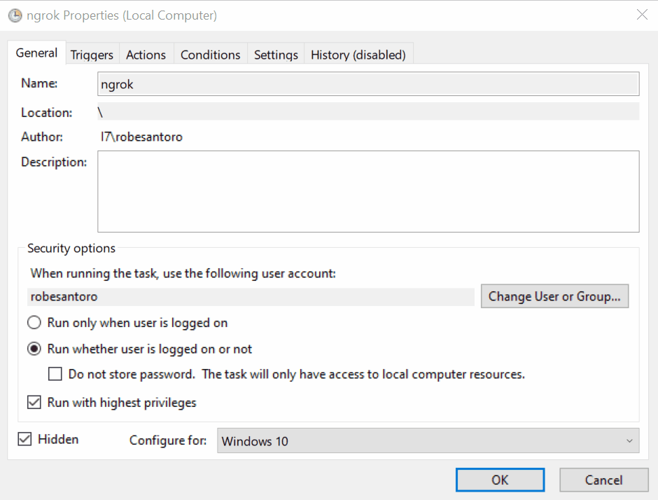

# [**ngrokme.py**](http://ngrokme.py)

## **Description**

**ngrokme.py** is a simple script for remote desktop control using Windows Remote Desktop Connection through a Ngrok tunnel.

It allows you to obtain the TCP address of your Ngrok tunnel endpoint and start a Windows ***Remote Desktop Connection*** to that endpoint.

> This can be useful for quickly and easily accessing a remote Windows machine via a Ngrok tunnel with a **free Ngrok account** that changes the TCP address every time the remote machine is restarted.

## Setup

Create an account at <https://ngrok.com/> and install the Ngrok client on both the client and remote machines.

### Client machine

1. **Install ngrok**\
   From an elevated command prompt to install Ngrok on Windows, Run:

   ```bash
   choco install ngrok
   ```

   or download ngrok.exe from <https://ngrok.com/download> and add it to your environment path.

2. **Add your Ngrok Auth Token to the Ngrok configuration**

   ```bash
   ngrok config add-authtoken <AuthToken>
   ```

   Your Auth Token can be found at <https://dashboard.ngrok.com/auth>

3. **Add your Ngrok API Key to the Ngrok configuration**

   Create an API token from <https://dashboard.ngrok.com/api> and add it to the ngrok configuration using:

   ```bash
   ngrok config add-api-key <API Key>
   ```

   Your config file located in `C:\Users\<UserName>\AppData\Local/ngrok/ngrok.yml` should look like this:

   ```bash
   version: "2"
   authtoken: <AuthToken>
   api_key: <API Key>
   ```

### **Remote machine**

1. **Install ngrok**

2. **Add your Ngrok Auth Token to the Ngrok configuration**

3. **Create a TCP tunnel**

   ```bash
   ngrok tcp 3389
   ```

   This will create a TCP tunnel to the remote machine on port 3389 (RDP).

> You can set up an `ng.bat` batch file that runs on startup to create the TCP tunnel automatically, with the following content:
>
> ```pwsh
> powershell -WindowStyle Hidden -Command "& {Start-Process ngrok -ArgumentList 'tcp 3389'}"
> ```
>
> and add it to a scheduled task that runs it on startup automatically, using the task scheduler:
>
> 

## **Usage**

On the client machine, run:

```bash
python ngrokme.py
```

or download the [ngrokme.exe](https://github.com/RobeSantoro/ngrokme/releases/download/v1.0/ngrokme.exe) from the releases page and run it.

## **Important Notes**

- Make sure your Ngrok tunnel is up and running before executing this script.
- You might be prompted for authentication when connecting to the remote Windows machine.
- Beware of firewall rules that might block the Remote Desktop Connection.

## **Building**

To build the executable, run:

On Windows

```bash
pyinstaller --onefile --icon=media/ngrok.ico ngrokme.py
```

On MacOs

```bash
pyinstaller --onefile --icon=media/ngrok.ico --add-data "template.rdp:." ngrokme.py
```

## **Disclaimer**

Please use this script responsibly and in compliance with ngrok's terms of service. Consider buying a ngrok license. In this way, you can have a fixed TCP address and avoid the use of this script.